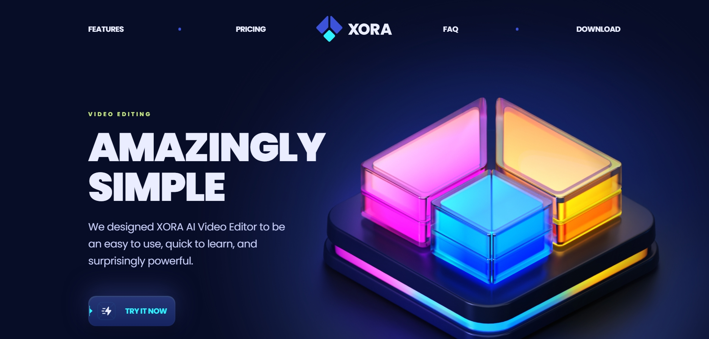

# 🚀 SaaSify – Modern Landing Page for SaaS Services

**SaaSify** is a modern, responsive, and clean landing page built with **React** and **Tailwind CSS**.  
Ideal for showcasing software, web apps, or any SaaS and startup service.

---

## 📌 Project Overview

This project is a **single-page landing page** designed with a focus on simplicity and high conversion rate.  
Built quickly using React functional components and utility-based styling with Tailwind, it includes:

- 🎯 Call-to-Action buttons  
- 🎨 Minimal and elegant design  
- 📱 Fully responsive on mobile, tablet, and desktop  
- ⚡ Fast loading speed (powered by Vite)  

---

## 🧱 Technologies Used

| Technology   | Description                          |
|--------------|------------------------------------|
| React        | UI library based on components     |
| TailwindCSS  | Utility-first CSS framework         |
| Vite         | Fast development and bundling tool |
| GitHub       | Version control and project hosting|

---

## 📁 Project Structure

